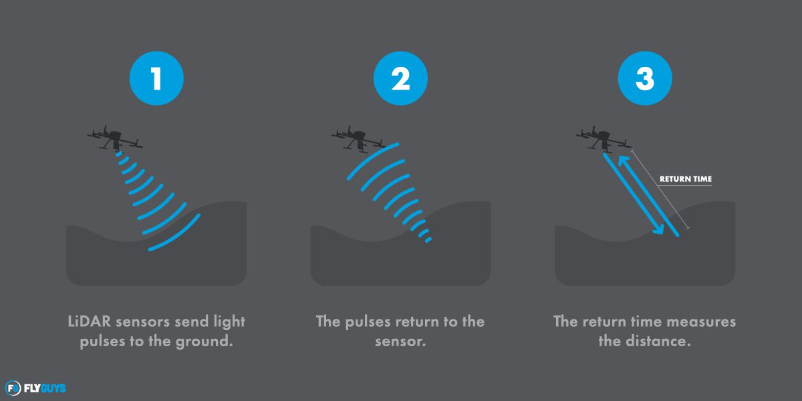

```{r setup, include=FALSE}
library(RefManageR)
BibOptions(check.entries = FALSE,
           bib.style = "authoryear",
           cite.style = "authoryear",
           style = "markdown",
           hyperlink = TRUE,
           dashed = FALSE,
           no.print.fields = c("doi", "url", "urldate", "issn"))
myBib <- ReadBib("Slides.bib", check = FALSE)
```
#Introduction to LiDAR

###What is it?

- LiDAR - <span style="color:red;">Li</span>ght <span style="color:red;">D</span>etection <span style="color:red;">a</span>nd <span style="color:red;">R</span>anging

- Provide high resolution spatial point cloud data

###How it works?
- **Active** senor (Remember Week1!):Send laser light onto the target and measure the reflected light to recognize the variation in wavelength and arrival time.

```{r  echo=FALSE, out.width='40%', fig.align='center'}

```
Working principle of LiDAR. Source: https://flyguys.com/lidar-vs-radar/

---

#History and development

```{r  echo=FALSE, out.width='64%', fig.align='center'}


```

History and development of LiDAR. Source: https://www.reddit.com/r/equatortutorials/comments/1b3trbm/history_of_lidar/
---

#Two main types of LiDAR
###Airborne

Airbone LiDARs point **downwards** and scan 180 degrees of solid angle. Usually they are installed in an **aircraft** or a **helicopter**`r Citep(myBib, "mehendaleReviewLidarTechnology2020")`.

.pull-left[
- Topographic

 - forestry
 
 - urban planning
 
 - landscape ecology

- Bathymetric

 - water penetration
 ]
 
.pull-right[

</figcaption>
Airbone LiDAR. Source: https://lidarnews.com/wp-content/uploads/2018/10/Figure-1-Aerial-Laser-Altimeter-420x315.png
</figcaption>
]
---

#Two main types of LiDAR
###Terrestrial

Terrestrial LiDARs perform the **horizontal** scan and cover 360 degrees in 1D and 2D. It collects points with high accuracy to enable precise identification of objects`r Citep(myBib, "mehendaleReviewLidarTechnology2020")`.

.pull-left[
- Mobile

 - analyze road infrastructure
 
 - locate incoming road signs

- Static
 - engineerning
 
 - archaeology
 
 - mining
]

.pull-right[

Terrestrial LiDAR. Source: https://earthobservatory.sg/images/default-source/facilities-images/new/facilities-lidar9bda408c1ed3442782fd7063b8648ade.jpeg?sfvrsn=f5090475_2
]
---

#Case study 1: Land Cover Classification
###LiDAR used in natural environment

1. The usage of LiDAR

    Airbone LiDAR collected the elevation and intensity data. No need for manipulating multispectral image files.
    
1. Methodology

    Based on the collected data, using a supervised object-orientated approach and frequency distribution parameters (skewness and kurtosis) to classify forest and ground type at three meanders of the Garonne and Allier rivers in France.`r Citep(myBib, "antonarakisObjectbasedLandCover2008")`


```{r  echo=FALSE, out.width='45%', fig.align='center'}


```

---

#Case study 2: Land Cover Classification
###LiDAR used in urban areas

1. The usage of LiDAR

    Airbone LiDAR collected the elevation and intensity data of the first and last return.
    
1. Methodology

    Using the difference of the elevation and intensity of two times to classify land cover types at the object level in urban areas in Cambridge`r Citep(myBib, "chenObjectBasedMethodUrban2014")`.

```{r  echo=FALSE, out.width='68%', fig.align='center'}


```
---

# Advantages and Limitations
###&nbsp;&nbsp;&nbsp;&nbsp;&nbsp;&nbsp;Advantages&nbsp;&nbsp;&nbsp;&nbsp;&nbsp;&nbsp;&nbsp;&nbsp;&nbsp;&nbsp;&nbsp;&nbsp;&nbsp;&nbsp;&nbsp;&nbsp;&nbsp;&nbsp;&nbsp;&nbsp;&nbsp;&nbsp;&nbsp;&nbsp;&nbsp;&nbsp;&nbsp;&nbsp;&nbsp;&nbsp;&nbsp;&nbsp;&nbsp;&nbsp;&nbsp;&nbsp;&nbsp;&nbsp;&nbsp;&nbsp;&nbsp;&nbsp;&nbsp;&nbsp;&nbsp;&nbsp;&nbsp;&nbsp;&nbsp;&nbsp;Limitations
.pull-left[
- **High Precision**: Delivers detailed 3D data with excellent accuracy;

- **Efficient Coverage**: Quickly scans vast terrains;

- **Night Operation**: Reveals ground surface beneath canopies;

- **Operational Flexibility**: Functions in darkness or low light`r Citep(myBib, "StrengthsLimitationsLiDAR")`.
]

.pull-right[

- **Data Complexity**: Demands advanced processing of dense 3D data;

- **Vegetation Density Challenge**: Struggles with extremely dense foliage;

- **High Cost**: Significant investment in equipment and analysis;

- **Lack of Color**: Requires additional data for detailed interpretation`r Citep(myBib, "StrengthsLimitationsLiDAR2024")`.

]
---

# The future of LiDAR in urban sensing
1. **3D Urban Modeling**: Advances in LiDAR enable precise 3D modeling of cityscapes for planning and management;

2. **Ecosystem & Weather Insights**:  LiDAR provides detailed insights into urban ecosystems and weather patterns, aiding in better forecasting;

3. **Infrastructure Monitoring**: Essential for assessing and ensuring the safety of urban infrastructure like bridges and building;

4. **Challenges & Opportunities**: Addressing data complexity and cost, with innovations and networked LiDAR systems presenting new opportunities`r Citep(myBib, "wangChallengesOpportunitiesLidar2021")`.

```{r  echo=FALSE, out.width='50%', fig.align='center'}


```
<figcaption>
LiDAR 3D model of London. Source: https://upload.wikimedia.org/wikipedia/commons/0/03/Lidar_3D_Model_of_London.jpg
</figcaption>
---

#References

```{r ref-list, echo=FALSE, results='asis', warning=FALSE}
PrintBibliography(myBib)
```
